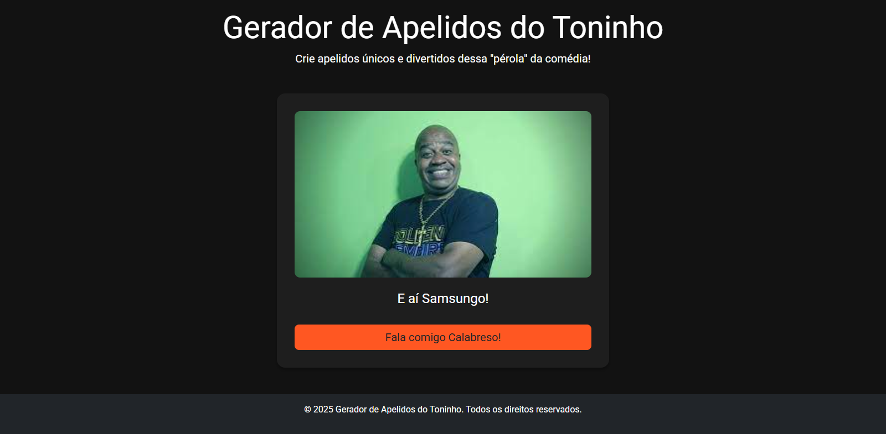

# Gerador de Apelidos do Toninho



## 📄 Sumário

- [Descrição](#descrição)
- [Funcionalidades](#funcionalidades)
- [Tecnologias Utilizadas](#tecnologias-utilizadas)
- [Estrutura de Pastas](#estrutura-de-pastas)
- [Instalação](#instalação)
- [Uso](#uso)
- [Contribuição](#contribuição)
- [Licença](#licença)
- [Contato](#contato)

## 📖 Descrição

Bem-vindo ao **Gerador de Apelidos do Toninho**! Este projeto é uma aplicação web interativa que permite aos usuários gerar apelidos únicos e divertidos inspirados no personagem "Toninho". Ideal para adicionar um toque de humor e criatividade em conversas informais, redes sociais ou qualquer ambiente que necessite de um apelido personalizado.

## ✨ Funcionalidades

- **Geração Aleatória de Apelidos:** Clique no botão para gerar um apelido único e engraçado.
- **Imagens Aleatórias:** Cada apelido gerado é acompanhado por uma imagem aleatória para tornar a experiência mais visual e divertida.
- **Copiar Apelido:** Clique no apelido gerado para copiá-lo facilmente para a área de transferência.
- **Design Responsivo:** Interface adaptável para diferentes dispositivos, garantindo uma ótima experiência tanto em desktops quanto em dispositivos móveis.

## 🛠️ Tecnologias Utilizadas

- **HTML5:** Estruturação semântica do conteúdo.
- **CSS3:** Estilização personalizada com Flexbox para layout responsivo.
- **Bootstrap 5:** Framework CSS para componentes responsivos e utilitários.
- **Google Fonts:** Tipografia moderna com a fonte "Roboto".
- **JavaScript:** Lógica de geração de apelidos e interatividade.
- **Favicon Personalizado:** Ícone representativo do aplicativo.

## 📁 Estrutura de Pastas

```
leorodriguesdev-coe-toninho/
├── index.html
└── img/
    ├── 1.png
    ├── 2.png
    ├── 3.png
    ├── 4.png
    ├── 5.png
    ├── 6.png
    ├── 7.png
    └── favicon.ico
```

- **index.html:** Arquivo principal da aplicação.
- **img/:** Diretório que contém as imagens utilizadas na aplicação, incluindo o favicon.

## 🛠️ Instalação

Para executar este projeto localmente, siga os passos abaixo:

1. **Clone o Repositório:**

   ```bash
   git clone https://github.com/leorodriguesdev/leorodriguesdev-coe-toninho.git
   ```

2. **Navegue até o Diretório do Projeto:**

   ```bash
   cd leorodriguesdev-coe-toninho
   ```

3. **Abra o Arquivo `index.html` no Seu Navegador:**

   - Você pode simplesmente dar um duplo clique no arquivo `index.html`, ou
   - Utilizar um servidor local (como o [Live Server](https://marketplace.visualstudio.com/items?itemName=ritwickdey.LiveServer) para VSCode) para uma experiência mais fluida.

## 🚀 Uso

1. **Gerar um Apelido:**
   - Clique no botão **"Fala comigo Calabreso!"** para gerar um novo apelido.
   - Um apelido aleatório será exibido na tela juntamente com uma imagem correspondente.

2. **Copiar o Apelido:**
   - Clique no apelido gerado para copiá-lo automaticamente para a área de transferência.
   - Um tooltip **"Copiado!"** aparecerá confirmando a ação.

## 🤝 Contribuição

Contribuições são bem-vindas! Sinta-se à vontade para abrir issues ou enviar pull requests para melhorar este projeto.

1. **Fork o Repositório**
2. **Crie uma Branch para Sua Feature:**

   ```bash
   git checkout -b feature/nova-feature
   ```

3. **Commit Suas Alterações:**

   ```bash
   git commit -m "Adiciona nova feature"
   ```

4. **Push para a Branch:**

   ```bash
   git push origin feature/nova-feature
   ```

5. **Abra um Pull Request**

## 📜 Licença

Este projeto está licenciado sob a licença [MIT](./LICENSE).

## 📫 Contato

Desenvolvido por **Leonardo Rodrigues**.

- **LinkedIn:** [linkedin.com/in/leorodriguesdev](https://linkedin.com/in/leorodriguesdev)
- **Portfólio:** [leorodrigues.dev](https://www.leorodrigues.dev/)

---

© 2025 Gerador de Apelidos do Toninho. Todos os direitos reservados.